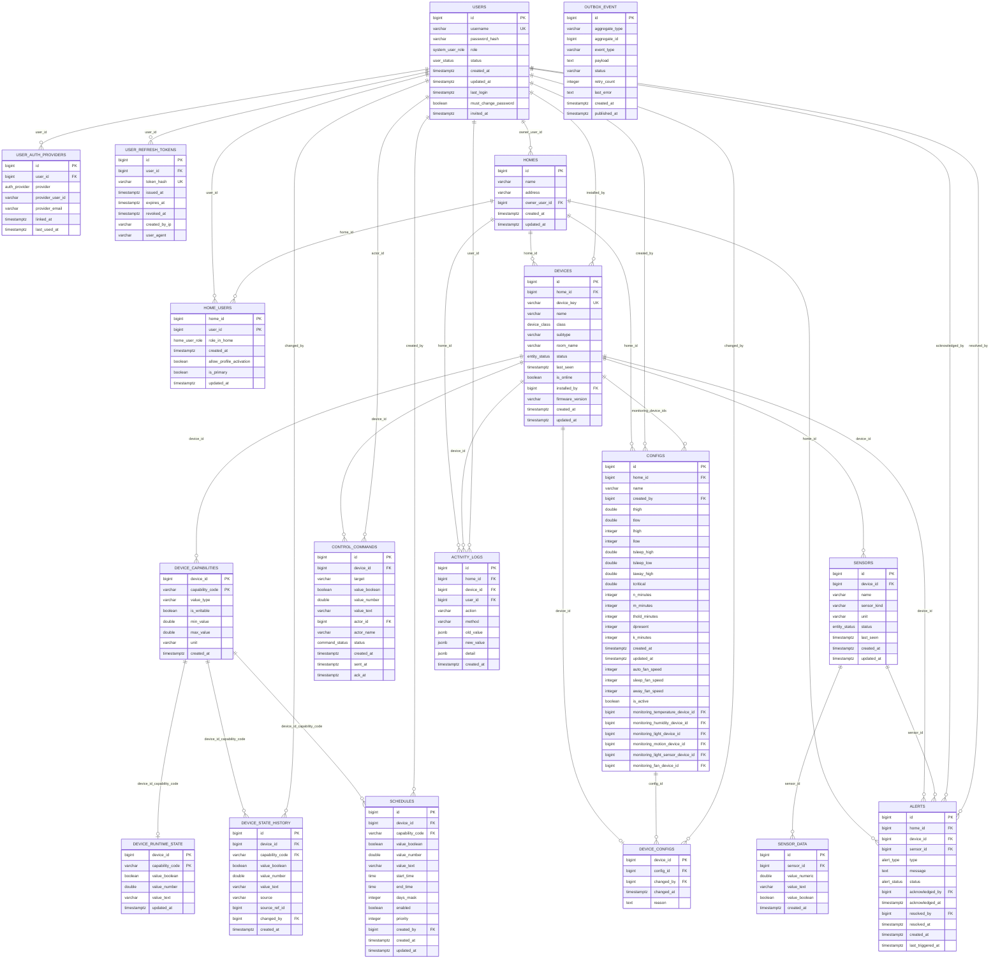

# ERD cơ sở dữ liệu Smart House

Nguồn lược đồ: `backend/db/init.sql`.

```mermaid
erDiagram
    USERS {
        bigint id PK
        varchar username UK
        varchar password_hash
        system_user_role role
        user_status status
        timestamptz created_at
        timestamptz updated_at
        timestamptz last_login
        boolean must_change_password
        timestamptz invited_at
    }

    USER_AUTH_PROVIDERS {
        bigint id PK
        bigint user_id FK
        auth_provider provider
        varchar provider_user_id
        varchar provider_email
        timestamptz linked_at
        timestamptz last_used_at
    }

    USER_REFRESH_TOKENS {
        bigint id PK
        bigint user_id FK
        varchar token_hash UK
        timestamptz issued_at
        timestamptz expires_at
        timestamptz revoked_at
        varchar created_by_ip
        varchar user_agent
    }

    HOMES {
        bigint id PK
        varchar name
        varchar address
        bigint owner_user_id FK
        timestamptz created_at
        timestamptz updated_at
    }

    HOME_USERS {
        bigint home_id PK
        bigint user_id PK
        home_user_role role_in_home
        timestamptz created_at
        boolean allow_profile_activation
        boolean is_primary
        timestamptz updated_at
    }

    DEVICES {
        bigint id PK
        bigint home_id FK
        varchar device_key UK
        varchar name
        device_class class
        varchar subtype
        varchar room_name
        entity_status status
        timestamptz last_seen
        boolean is_online
        bigint installed_by FK
        varchar firmware_version
        timestamptz created_at
        timestamptz updated_at
    }

    DEVICE_CAPABILITIES {
        bigint device_id PK
        varchar capability_code PK
        varchar value_type
        boolean is_writable
        double min_value
        double max_value
        varchar unit
        timestamptz created_at
    }

    DEVICE_RUNTIME_STATE {
        bigint device_id PK
        varchar capability_code PK
        boolean value_boolean
        double value_number
        varchar value_text
        timestamptz updated_at
    }

    DEVICE_STATE_HISTORY {
        bigint id PK
        bigint device_id FK
        varchar capability_code FK
        boolean value_boolean
        double value_number
        varchar value_text
        varchar source
        bigint source_ref_id
        bigint changed_by FK
        timestamptz created_at
    }

    DEVICE_CONFIGS {
        bigint device_id PK
        bigint config_id FK
        bigint changed_by FK
        timestamptz changed_at
        text reason
    }

    CONFIGS {
        bigint id PK
        bigint home_id FK
        varchar name
        bigint created_by FK
        double thigh
        double tlow
        integer lhigh
        integer llow
        double tsleep_high
        double tsleep_low
        double taway_high
        double tcritical
        integer n_minutes
        integer m_minutes
        integer thold_minutes
        integer dpresent
        integer k_minutes
        timestamptz created_at
        timestamptz updated_at
        integer auto_fan_speed
        integer sleep_fan_speed
        integer away_fan_speed
        boolean is_active
        bigint monitoring_temperature_device_id FK
        bigint monitoring_humidity_device_id FK
        bigint monitoring_light_device_id FK
        bigint monitoring_motion_device_id FK
        bigint monitoring_light_sensor_device_id FK
        bigint monitoring_fan_device_id FK
    }

    CONTROL_COMMANDS {
        bigint id PK
        bigint device_id FK
        varchar target
        boolean value_boolean
        double value_number
        varchar value_text
        bigint actor_id FK
        varchar actor_name
        command_status status
        timestamptz created_at
        timestamptz sent_at
        timestamptz ack_at
    }

    SENSORS {
        bigint id PK
        bigint device_id FK
        varchar name
        varchar sensor_kind
        varchar unit
        entity_status status
        timestamptz last_seen
        timestamptz created_at
        timestamptz updated_at
    }

    SENSOR_DATA {
        bigint id PK
        bigint sensor_id FK
        double value_numeric
        varchar value_text
        boolean value_boolean
        timestamptz created_at
    }

    SCHEDULES {
        bigint id PK
        bigint device_id FK
        varchar capability_code FK
        boolean value_boolean
        double value_number
        varchar value_text
        time start_time
        time end_time
        integer days_mask
        boolean enabled
        integer priority
        bigint created_by FK
        timestamptz created_at
        timestamptz updated_at
    }

    ALERTS {
        bigint id PK
        bigint home_id FK
        bigint device_id FK
        bigint sensor_id FK
        alert_type type
        text message
        alert_status status
        bigint acknowledged_by FK
        timestamptz acknowledged_at
        bigint resolved_by FK
        timestamptz resolved_at
        timestamptz created_at
        timestamptz last_triggered_at
    }

    ACTIVITY_LOGS {
        bigint id PK
        bigint home_id FK
        bigint device_id FK
        bigint user_id FK
        varchar action
        varchar method
        jsonb old_value
        jsonb new_value
        jsonb detail
        timestamptz created_at
    }

    OUTBOX_EVENT {
        bigint id PK
        varchar aggregate_type
        bigint aggregate_id
        varchar event_type
        text payload
        varchar status
        integer retry_count
        text last_error
        timestamptz created_at
        timestamptz published_at
    }

    USERS ||--o{ USER_AUTH_PROVIDERS : user_id
    USERS ||--o{ USER_REFRESH_TOKENS : user_id
    USERS ||--o{ HOMES : owner_user_id
    USERS ||--o{ HOME_USERS : user_id
    HOMES ||--o{ HOME_USERS : home_id

    HOMES ||--o{ DEVICES : home_id
    USERS ||--o{ DEVICES : installed_by
    HOMES ||--o{ CONFIGS : home_id
    USERS ||--o{ CONFIGS : created_by

    DEVICES ||--o{ DEVICE_CAPABILITIES : device_id
    DEVICE_CAPABILITIES ||--o| DEVICE_RUNTIME_STATE : device_id_capability_code
    DEVICE_CAPABILITIES ||--o{ DEVICE_STATE_HISTORY : device_id_capability_code
    USERS ||--o{ DEVICE_STATE_HISTORY : changed_by

    DEVICES ||--o| DEVICE_CONFIGS : device_id
    CONFIGS ||--o{ DEVICE_CONFIGS : config_id
    USERS ||--o{ DEVICE_CONFIGS : changed_by

    DEVICES ||--o{ CONTROL_COMMANDS : device_id
    USERS ||--o{ CONTROL_COMMANDS : actor_id

    DEVICES ||--o{ SENSORS : device_id
    SENSORS ||--o{ SENSOR_DATA : sensor_id

    DEVICE_CAPABILITIES ||--o{ SCHEDULES : device_id_capability_code
    USERS ||--o{ SCHEDULES : created_by

    HOMES ||--o{ ALERTS : home_id
    DEVICES ||--o{ ALERTS : device_id
    SENSORS ||--o{ ALERTS : sensor_id
    USERS ||--o{ ALERTS : acknowledged_by
    USERS ||--o{ ALERTS : resolved_by

    HOMES ||--o{ ACTIVITY_LOGS : home_id
    DEVICES ||--o{ ACTIVITY_LOGS : device_id
    USERS ||--o{ ACTIVITY_LOGS : user_id

    DEVICES ||--o{ CONFIGS : monitoring_device_ids
```
